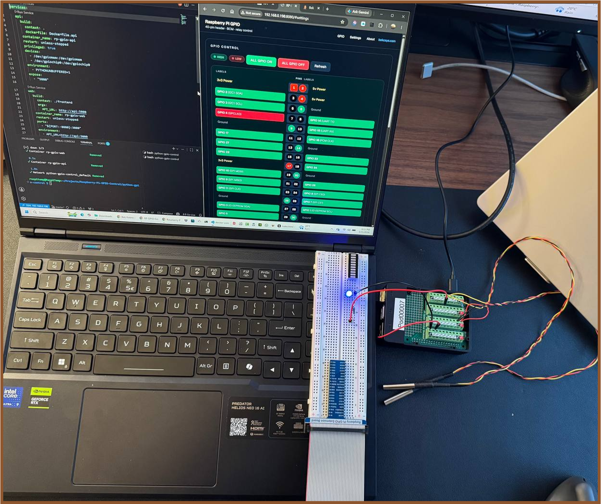
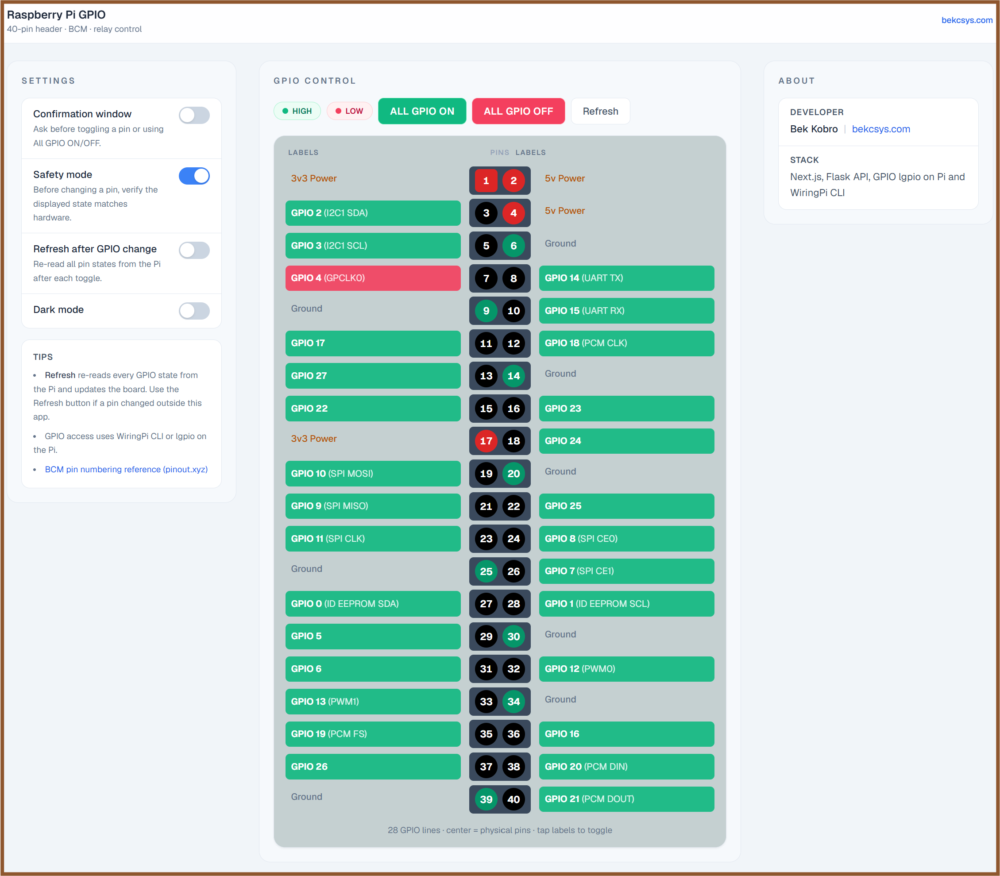
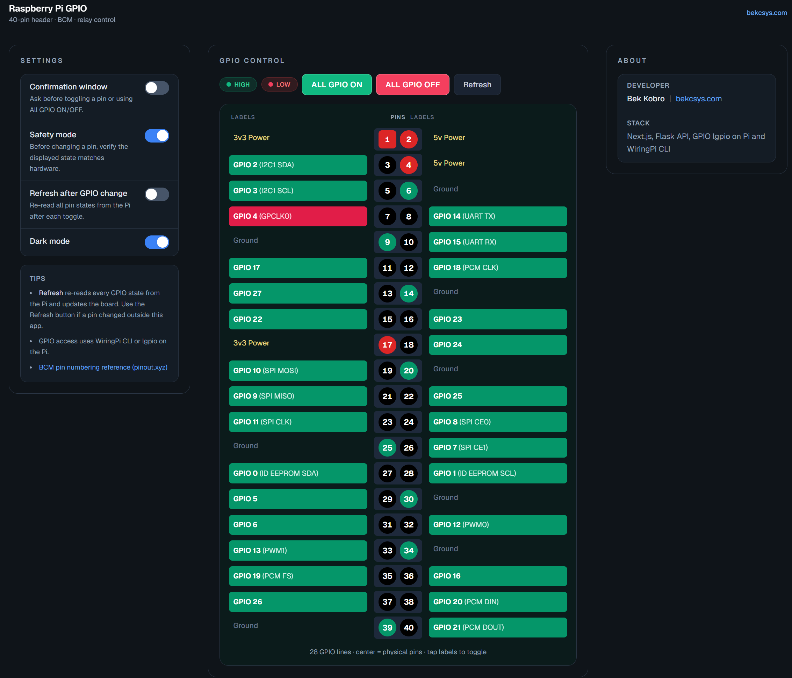

# WebApp : RaspberryPI GPIO Status and Control 

## Why this project ?


This project was developed to rapidly validate GPIO-based control logic for a Building Automation System (BAS) prototype. The primary objective was to monitor and control Raspberry Pi GPIO pins through a web interface while testing an 8-channel relay module. These relays act as control points for downstream devices such as:

- Solid State Relays (SSR)
- Water pumps
- Garage door actuators
- Lighting systems
- Temperature monitoring equipment, etc.

This tool provides a simple way to verify end-to-end operation between software commands, Raspberry Pi GPIO outputs, relay states, and connected field devices.





## How ? (implementation Details)

The tool is built with Next.js and a lightweight Flask API running on the Raspberry Pi.

### Architecture 

```
Next.js -> Flaks GPIO API -> [RaspberryPi GPIO interface -> Relay Module -> Field devices ]
```


```bash
make help
```

## Quick start

### Pull and run (Docker Hub — recommended on Raspberry Pi)

No clone or build required after images are published:

```bash
curl -fsSL https://raw.githubusercontent.com/bektade/RaspberryPi-GPIO-WebApp/master/python-gpio-control/scripts/hub-run.sh | bash
```

Or from a clone:

```bash
cp .env.example .env    # set DOCKER_USER to your Docker Hub namespace
make hub-up             # pull images and start
```

Open **http://\<pi-ip\>:8080**

Default images: `becktkh/rp-gpio-api:latest` and `becktkh/rp-gpio-web:latest`

Installs to `~/.rp-gpio-control/` when using the curl script.

### Build from source

```bash
make up          # Docker — Next.js on :8080, Flask API internal
make dev         # local — API :5000 + Next.js :3000 (needs npm install in frontend/)
```

To build and push images to Docker Hub, see **[README-DOCKER-HUB.md](README-DOCKER-HUB.md)**.

## Stack

| Layer | Tech |
|-------|------|
| UI | Next.js 15, React, Tailwind |
| API | Flask, lgpio / WiringPi |
| Deploy | Docker Compose |

## Dev setup

```bash
make install
cd frontend && npm install
make dev
```

- UI → http://localhost:3000  
- API → http://localhost:5000/api/gpio  

## API

| Request | Response |
|---------|----------|
| `GET /api/gpio?gpiostateall=` | All BCM states 0–28 |
| `GET /api/gpio?gpiostate=17` | Single pin |
| `GET /api/gpio?gpio=17&state=1` | Set pin, return verified state |

## Layout

```
python-gpio-control/
├── frontend/          Next.js app
├── app.py             Flask API
├── gpio_backend.py
├── docker-compose.yml
├── Dockerfile.api
└── Makefile
```


**Author:** [Bek Kobro](https://bekcsys.com/)  
**License:** [Apache License 2.0](LICENSE)